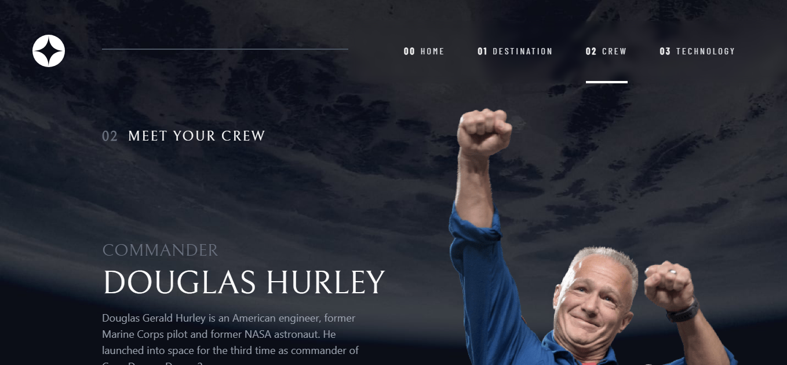

# Frontend Mentor - Space tourism website solution

This is a solution to the [Space tourism website challenge on Frontend Mentor](https://www.frontendmentor.io/challenges/space-tourism-multipage-website-gRWj1URZ3). Frontend Mentor challenges help you improve your coding skills by building realistic projects. 


## Table of contents

- [Overview](#overview)
  - [The challenge](#the-challenge)
  - [Screenshot](#screenshot)
  - [Links](#links)
- [My process](#my-process)
  - [Built with](#built-with)
  - [What I learned](#what-i-learned)
  - [Useful resources](#useful-resources)
- [Author](#author)
- [Acknowledgments](#acknowledgments)

## Overview

### The challenge

Users should be able to:

- View the optimal layout for each of the website's pages depending on their device's screen size
- See hover states for all interactive elements on the page
- View each page and be able to toggle between the tabs to see new information

### Screenshot

=> Dekstop





=> Tablet


=> Mobile


### Links

- Solution URL: [Add solution URL here](https://your-solution-url.com)
- Live Site URL: [Add live site URL here](https://your-live-site-url.com)

## My Process

### Built with

- Semantic HTML5 markup
- CSS custom properties
- Flexbox
- CSS Grid
- Dekstop-first workflow
- [React](https://reactjs.org/) - JS library
- [Tailwind CSS](https://tailwindcss.com/) - For styles

### What I learned

get data from json using useState :

```js
const Destination = () => {
  const [destinationData, setDestinationData] = useState({
    id: planets.destinations[0].id,
    image: planets.destinations[0].images.png,
    name: planets.destinations[0].name,
    description: planets.destinations[0].description,
    distance: planets.destinations[0].distance,
    travel: planets.destinations[0].travel,
  });
}
```

add a transparent background to the explore button on hover using Tailwind CSS :

```js
<div className="lg:absolute lg:right-6 lg:bottom-10 lg:w-[28rem] lg:h-[28rem] lg:hover:w-[28rem] lg:hover:h-[28rem] rounded-full hover:bg-white hover:bg-opacity-10 duration-1000 hover:duration-1000 ease-in-out">
    <div className="w-36 h-36 md:w-60 md:h-60 lg:w-72 lg:h-72 lg:relative lg:left-20 lg:top-20 hover:bg-opacity-100 rounded-full bg-white z-10">
        <p className="text-black text-xl md:text-2xl lg:text-4xl uppercase text-center relative top-16 md:top-28 lg:top-32">
            explore
        </p>
    </div>
</div>
```

### Useful resources

- [Example resource 1](https://www.codementor.io/@giorgiasambrotta/hamburger-menu-with-react-and-tailwind-css-1qx6sruvua) - This is an article that helped me create a sidebar menu in mobile.

## Author

- Frontend Mentor - [@yourusername](https://www.frontendmentor.io/profile/aldoraya_)

## Acknowledgments

if you have any suggestions please contact me on my email aldorayaalhakim@gmail.com